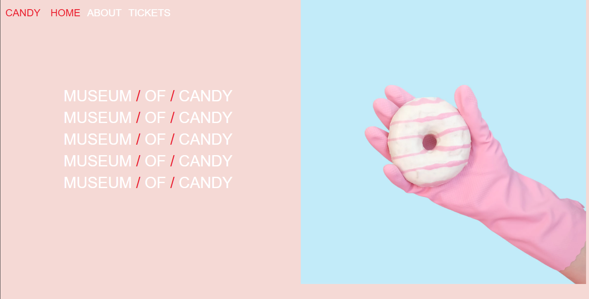

# 🍬 Candy Museum

A delightful virtual museum showcasing a collection of the world's most iconic candies. The website is built with HTML, CSS, and Bootstrap, providing a responsive and interactive experience for candy lovers everywhere.

---

## 📸 Screenshot


---

## 🔗 Live Demo
Check out the live website here: [Your Live Link](https://kaweeshwara.github.io/Candy-Museum/)

---

## 📂 Features
- Responsive design that works across all devices (thanks to Bootstrap).
- Easy navigation through the museum's candy exhibits.
- Interactive sections for each candy type, with rich images and descriptions.
- Fun and engaging design that reflects the sweetness of the theme.

---

## 🛠️ Tech Stack
- **Languages**: HTML, CSS, JavaScript
- **Framework**: Bootstrap (for responsive design)
- **Hosting**: GitHub Pages

---

## 🚀 Getting Started
1. Clone the repository:
   ```bash
   git clone https://github.com/kaweeshwara/Candy-Museum.git
